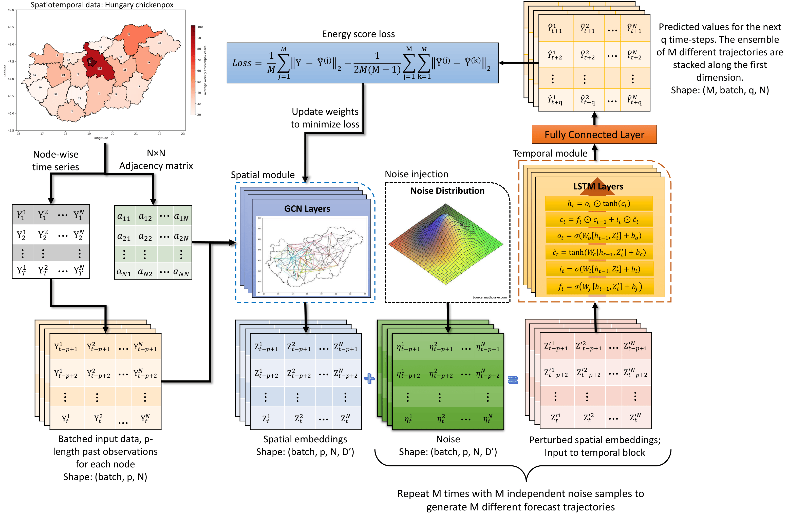

# Deep Generative Spatiotemporal Engression for Probabilistic Forecasting

[](https://arxiv.org/abs/2603.07108) [](https://opensource.org/licenses/MIT)

This repository contains the official implementation of the paper **"Deep Generative Spatiotemporal Engression for Probabilistic Forecasting of Epidemics"** by Rajdeep Pathak and Tanujit Chakraborty.


We introduce **Deep Spatiotemporal Engression**, a novel method for generating accurate and reliable probabilistic forecasts, specifically designed for low-frequency spatiotemporal datasets. Acting as distributional lenses, these methods generate out-of-sample probabilistic forecasts by sampling from trained models. 

### Key Contributions:
* **Lightweight Deep Generative Architecture**: Replaces heavy conventional models while maintaining high accuracy.
* **Endogenous Uncertainty Quantification**: Uncertainty is driven by a pre-additive noise component during model construction.
  

## 🚀 Models

We propose three spatiotemporal engression models:
* Graph Convolutional Engression Network (GCEN)
* Spatio-Temporal Engression Network (STEN)
* Multivariate Engression Network (MVEN)

## 🧠 Model Architecture


*Figure: Architecture of the Graph Convolutional Engression Network (GCEN).*

## ⚙️ Installation

You can install the package directly via PyPI or clone the repository to install it from the source.

### Option 1: Install via PyPI (Recommended)
```bash
pip install stengression
```

### Option 2: Install from Source
If you want to modify the code or run the latest development version, you can clone the repository:
```bash
git clone https://github.com/PyCoder913/stengression.git
cd stengression
pip install -r requirements.txt
```

## 📝 Citation
If you use this code, models, or find our work helpful in your research, please consider citing our paper:
```bibtex
@article{pathak2026deep,
  title={Deep Generative Spatiotemporal Engression for Probabilistic Forecasting of Epidemics},
  author={Pathak, Rajdeep and Chakraborty, Tanujit},
  journal={arXiv preprint arXiv:2603.07108},
  year={2026}
}
